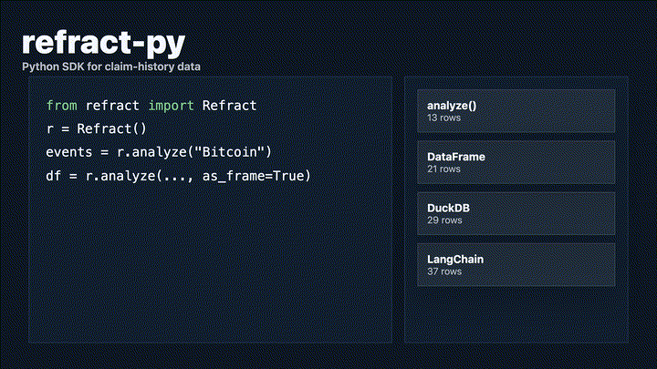

# refract-py

<p align="center">
  
</p>

Python SDK for [Refract](https://github.com/refract-org/refract) — the open claim-history layer for public knowledge.

```bash
pip install refract-py
```

Requires the [Refract CLI](https://github.com/refract-org/refract):
```bash
npm install -g @refract-org/cli
```

## Usage

```python
from refract import Refract

r = Refract()

# Analyze a page, get typed dataclasses
events = r.analyze("Bitcoin", depth="brief")
for event in events:
    print(event.eventType, event.timestamp)

# Export as pandas DataFrame
df = r.analyze("Bitcoin", depth="forensic", as_frame=True)
print(df.groupby("event_type").size())

# Export flattened CSV-compatible rows
df = r.export("Bitcoin", format="ndjson", flatten=True, as_frame=True)
```

## Integrations

| Tool | How |
|---|---|
| **pandas** | `as_frame=True` returns DataFrames with flattened provenance fields |
| **Jupyter** | Analyze pages, plot citation churn, export findings — all from a notebook |
| **LangChain** | `refract_langchain.py` loads events as `Document` objects with stability metadata for provenance-aware RAG |
| **DuckDB** | Export as NDJSON, query with SQL: `SELECT * FROM 'events.jsonl'` |

See the [Python SDK tutorial](https://refract-org.github.io/refract-docs/tutorials/python-sdk/) and [integrations docs](https://refract-org.github.io/refract-docs/integrations/) for full workflows.

## License

AGPL-3.0.
